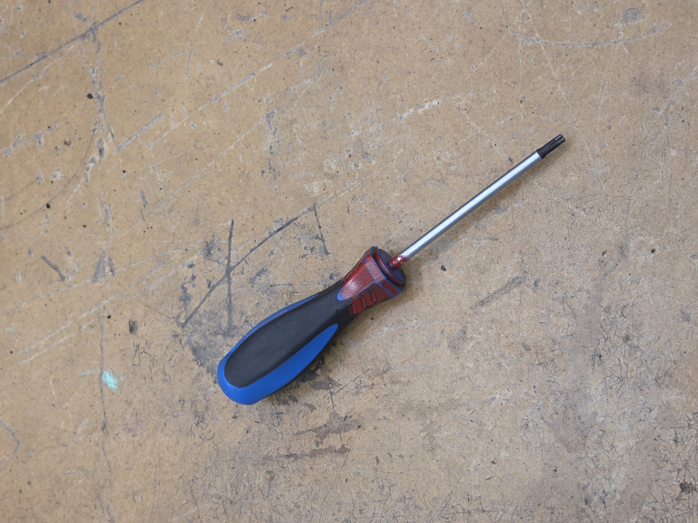

Introduksjon til nevrale nettverk
Samling 1 Oppgave

Steg-for-steg
1. Samle datasett

Som gruppe skal dere samle totalt 30 bilder av 2–3 forskjellige verktøy fra prototype-laben.
2. Lag masker (labels)

For hvert bilde skal dere lage en binær maske (hvit = verktøy, svart = bakgrunn). Hvilket verktøy dere bruker for å lage maskene, bestemmer dere selv.
3. Ekstraher features med DinoV3

    Følg eksemplet fra notebooken dere har gått gjennom.
    Kjør segmentering på deres egne bilder.
    Bruk output fra DinoV3 som feature-vektorer.

4. Tren logistisk regresjon

    Bruk features (X) og labels (y) fra maskene.
    Tren en logistisk regresjon til å skille mellom verktøy og bakgrunn.

5. Test modellen

    Bruk nye bilder (som modellen ikke har sett før).
    Prediker maske for disse bildene.
    Visualiser: vis originalbildet og den predikerte masken.

# Introduksjon til nevrale nettverk Oppgave - Samling 1

## 1. Samle datasett
 Gruppen har tatt bilde av vektøy som vi fant på verkstedet på skolen.

 Eksempelbilder:

## 2. Lag masker (labels)
Det er viktig at bildet og masken matcher dvs. at masken dekker over objektet når den legges over bildet. De må derfor ha samme oppløsning og være rotert i samme rettning.
Masken ble lagd med GIMP som er et bilderedigeringsprogram. Objektet ble merkert med lassoverktøyet og klippet ut. Det utklippede objektet ble limt inn i nytt lag og farget sort. Orginal bildet ble lagret som .jpg og masken som .png.

## 3. Ekstraher features med DinoV3 & 4. Tren logistisk regresjon
For å ekstahere features fra bildene og lage en logistisk regresjon brukes jupyter notebooken **Train.ipynb** 

## 5. Test modellen
