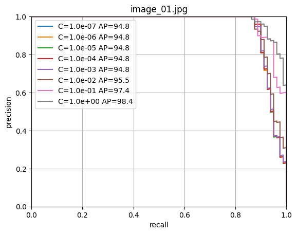
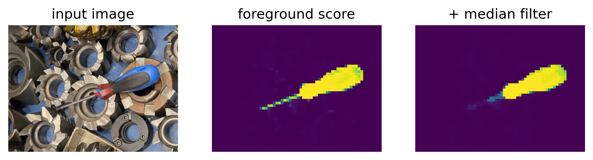
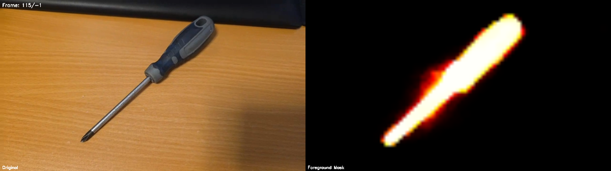

Introduksjon til nevrale nettverk
Samling 1 Oppgave

Steg-for-steg
1. Samle datasett

Som gruppe skal dere samle totalt 30 bilder av 2–3 forskjellige verktøy fra prototype-laben.
2. Lag masker (labels)

For hvert bilde skal dere lage en binær maske (hvit = verktøy, svart = bakgrunn). Hvilket verktøy dere bruker for å lage maskene, bestemmer dere selv.
3. Ekstraher features med DinoV3

    Følg eksemplet fra notebooken dere har gått gjennom.
    Kjør segmentering på deres egne bilder.
    Bruk output fra DinoV3 som feature-vektorer.

4. Tren logistisk regresjon

    Bruk features (X) og labels (y) fra maskene.
    Tren en logistisk regresjon til å skille mellom verktøy og bakgrunn.

5. Test modellen

    Bruk nye bilder (som modellen ikke har sett før).
    Prediker maske for disse bildene.
    Visualiser: vis originalbildet og den predikerte masken.

# Introduksjon til nevrale nettverk Oppgave - Samling 1

## 1. Samle datasett
 Gruppen har tatt bilde av vektøy som vi fant på verkstedet på skolen.

 Eksempelbilder:

## 2. Lag masker (labels)
Det er viktig at bildet og masken matcher dvs. at masken dekker over objektet når den legges over bildet. De må derfor ha samme oppløsning og være rotert i samme rettning.
Masken ble lagd med GIMP som er et bilderedigeringsprogram. Objektet ble merkert med lassoverktøyet og klippet ut. Det utklippede objektet ble limt inn i nytt lag og farget sort. Orginal bildet ble lagret som .jpg og masken som .png.

## 3. Ekstraher features med DinoV3
For å ekstahere features fra bildene og lage en logistisk regresjon brukes jupyter notebooken **Train.ipynb** 

Denne delen av koden lagerer hvert bilde fra listen av bilder som heter  **images** behandler dem og lagrer dem som en tensor **xs**
> mask_i = labels[i].split()[-1]
> 
> mask_i_resized = resize_transform(mask_i)
> 
> mask_i_quantized = patch_quant_filter(mask_i_resized).squeeze().view(-1).detach().cpu()
> 
> ys.append(mask_i_quantized)
> 
> ys = torch.cat(ys)

Denne delen av koden tar ut features fra hvert bilde i listen av bilder som heter **images** lagerer dem i som en liste av features som en tensor **xs**
> image_i = images[i].convert('RGB')
> 
> image_i_resized = resize_transform(image_i)
> 
> image_i_resized = TF.normalize(image_i_resized, mean=IMAGENET_MEAN, std=IMAGENET_STD)
> 
> image_i_resized = image_i_resized.unsqueeze(0).cuda()
> 
> feats = model.get_intermediate_layers(image_i_resized, n=range(n_layers), reshape=True, norm=True)
>
> xs.append(feats[-1].squeeze().view(dim, -1).permute(1,0).detach().cpu())
>
> xs = torch.cat(xs)

Hold kontroll på hvilket bilde tensorelementene tilhører
> image_index.append(i * torch.ones(ys[-1].shape))

Behold fjern alle elementer som hverken er 0 eller 1 i masken.
>  idx = (ys < 0.01) | (ys > 0.99)
> 
> xs = xs[idx]
> 
> ys = ys[idx]
> 
> image_index = image_index[idx]

## 4. Tren logistisk regresjon

Gå gjennom alle bildene. Alle bildene og maskene untatt det valgte bildet benyttes til å trene modelle, dette gjøres med masken **train_selection** som er True for bilder som skal brukes i trening og False for de som skal benyttes til validering.
**fold_x** inneholder alle bildene som modellen skal trenes på og **fold_y** inneholder alle maskene modellen skal trenes på.
**val_x** innholder valdieringsbildet og **val_y** inneholder valideringsmasken.

> for i in range(n_images):
> 
>     print('validation using image_{:02d}.jpg'.format(i+1))
> 
>     train_selection = image_index != float(i)
> 
>     fold_x = xs[train_selection].numpy()
> 
>     fold_y = (ys[train_selection] > 0).long().numpy()
> 
>     val_x = xs[~train_selection].numpy()
> 
>     val_y = (ys[~train_selection] > 0).long().numpy()

Denne delen av koden trener den logistiske modellen**clf** med **c** verdier som har økende størrelsesorden fra  fra 10^-7 til 1. De forskjellige modellene testes mot valideringsbildet og gir en verdi for recall og precision for hver **c** verdi.
> 
> cs = np.logspace(-7, 0, 8)
> 
> for j, c in enumerate(cs):
> 
>     print("training logisitic regression with C={:.2e}".format(c))
> 
>     clf = LogisticRegression(random_state=0, C=c, max_iter=10000).fit(fold_x, fold_y)
> 
>     output = clf.predict_proba(val_x)
> 
>     precision, recall, thresholds = precision_recall_curve(val_y, output[:, 1])
> 
>     s = average_precision_score(val_y, output[:, 1])
> 
>     scores[i, j] = s
> 
>     plt.plot(recall, precision, label='C={:.1e} AP={:.1f}'.format(c, s*100))

## 5. Test modellen
### Testbilder
Den trente modellen kan testes mot testbilder ved å kjøre **TestImages_TrainedModel.ipynb**.
Modellen vil markere med gul farge hvor i bildet den kjenner igjen verktøy.

### Webkamera
For å teste modellen live kan **Webcam_TrainedModel.ipynb** kjøres for å kjøre modellen mot webkamera.
Modellen vil markere med gul farge hvor i bildet den kjenner igjen verktøy.

